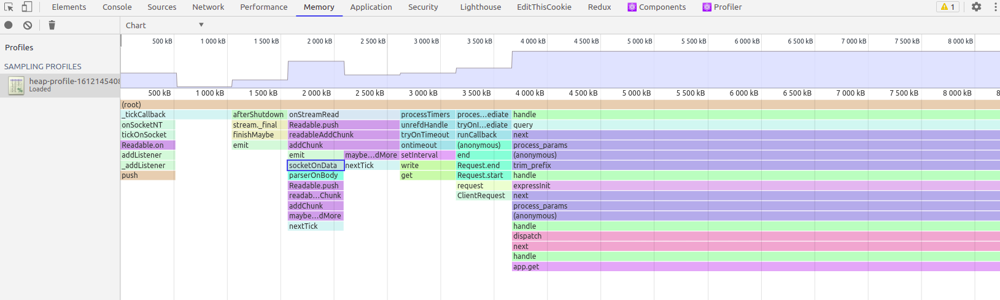

<h1 align="center">
    Code For Fun - Proxy Example</a>
    <br>
</h1>

<div align="center">


[]()

</div>

<h4 align="center">Simple React-Redux web app that display some blocks from http://http://blockchain.info</h4>

<br>

---

<h2>General Overview</h2>

This project was bootstrapped with [Create React App](https://github.com/facebook/create-react-app).

<p>The name of the application is f2c, stands for Code For Fun, as you can see the F is for Fun, "2" means that there is another F and the "c" stands code just to go fancy 😊.</p>

<p>At the beginning you will see a welcome page and you have to click on the "Let's Go!" button in order to see the blocks in simple Container. </p>

<p> Once you are in the Dashboard page you can click any magnifying glass to see more details about the selected Block like number of transactions, size, hash, previous hash and fee of the block. 
</p>

---

<h2>General Structure</h2>

<p> This App is mobile friendly, however I suggest you to interact with it from a desktop for a better experience.
</p>

<p> The App has two components:</p>
<ul>
  <li>Frontend: Built in Reack Redux</li>
  <li>Backend: Built in Node.js</li>
</ul>
<br>

---

<h2>Installation</h2>
<h3>Backend</h3>
<p> You can clone the repo assigned to me for this Coding Challenge
</p>

### `1. Open a terminal and clone the repo`

```
$ git clone git@github.com:JulioGT/cf2.git
```

### `2. Go to the backend folder`
```
$ cd bc2/backend/
```

### `3. Type "yarn" and hit enter`
```
:~/bc2/backend$ yarn
```

### `4. Turn the server on`
```
:~/bc2/backend$ node app.js
```

### `5. The application will run on PORT=5000 and you will see a welcome message`
```
Hallo, hören auf Anschluss: 6000
```

<h3>Frontend</h3>
<p>The application runs in development mode, your application will run on [http://localhost:3000].
</p>

### `1. Open a new terminal and go to the frontend folder`

```
$ cd frontend
```

### `2. Type "yarn" and hit enter`
```
:~/bc2/frontend$ yarn
```

### `3. Run the application`
```
:~/bc2/frontend$ yarn start
```

### `5. The application will run on PORT=3000, you can type this URL in the browser`
```
http://localhost:3000
```
<br>

---

<h2>Components</h2>
<ul>
    <li><b>Landing: </b>Welcome page.</li>
    <ul>
        <li>index</li>
        <li>Header</li>
        <li>Main</li>
        <li>Footer</li>
    </ul>
    <li><b>Dashboard: </b>To display the blocks in a Container from the backend.</li>
</ul>

---

<h2>Most Important Libraries</h2>

<ul>
    <li>axios</li>
    <li>reactstrap</li>
    <li>react-redux</li>
    <li>redux-thunk</li>
    <li>react-feather</li>
    <li>react-bootstrap</li>
</ul>


**Note: This project does not include Unit and Integration tests, this feature is out of scope due to time limitations**

---

<h2>Improvements</h2>

<h3>Automated Test with Jest</h3>
<p>Even though this app include two unit tests, I would improve the testing adding Integration Tests as well</p>

```
const initialState = {
  error: false
}


describe("Test getBlocks Actions", () => {
  let store;
  beforeEach(() => {
    moxios.install();
    store = mockStore(initialState);
  });
  afterEach(() => {
    moxios.uninstall();
  });

  it("verifies if there are blocks", () => {
    moxios.wait(function() {
      let request = moxios.requests.mostRecent();
      request.respondWith({
        status: 200,
        response: {
          "0":{
            hash: "123"
          }
        }
      });
    }); 

    const expectedActions = [
      {
        type: 'BLOCKS_LOADING',
        state: {
          token: 'loading'
        }
      }
    ];

    return store.dispatch(PostsActionCreators.getBlocks()).then(() => {
      const actualAction = store.getActions();
      expect(actualAction).toEqual(expectedActions);
    });

  });
```


<h3>Pagination</h3>
<p>There are some node packages out there, the way I would do it is with this package</p>

```
express-paginate
```

<h3>Redis for Caching</h3>
<p>When a specific hash is selected it takes a while to get its details back, the way I would do it is by using the 'hash' as key with all the information and with pagination as well and consuming the "rawblock" endpoint with Promises, all together with pagination.</p>

<h3>Memory Leak</h3>
<p>This is a mechanism to improve in some way the quality of the code, in a scenario where there are another colleagues interacting with the same app it is good to see how we can improve the code.</p>

<p>In my app you will see this comment:</p>


```diff
+ //FOR MEMORY LEAK PURPOSES
+ /********************
+ heapProfile.start();
 
+ // Write a snapshot to disk every 10 minutes
+ // You can then open the file and see what's going on with your server.
+ setInterval(() => {
+   heapProfile.write((err, filename) => {
+    console.log(`heapProfile.write. err: ${err} filename: ${filename}`);
+  });
+}, 6000).unref();
+*/
```
and

```diff
+ //MEMORY LIKING: UNCOMMENT FOR DEMONSTRATION PURPOSES ONLY
+  // const garbage = new Array(100000);  
```

